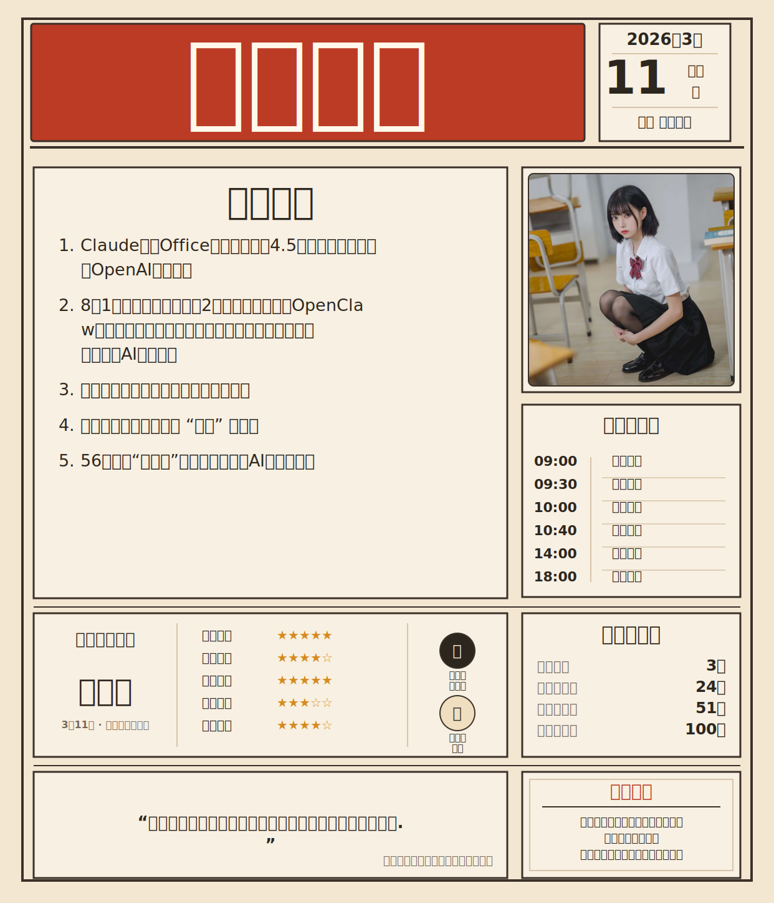

# Python Daily Poster

一个跨平台的 `摸鱼日报` 生成器。

使用 Python 标准库将 JSON 数据渲染成 SVG 海报，再按需转换成 PNG/JPG/WEBP 图片。默认只需传入个人信息，其他模块自动补齐。

## 特性

- 只传 `personal_info` 即可生成完整海报
- 自动生成日期、星期、农历
- 自动填充热点、右上图片、星座、假期倒计时、语录
- 跨平台：Linux / macOS / Windows
- SVG 渲染零依赖（纯 Python 标准库）
- 图片导出纯 Python 方案：`pip install resvg_py`
- 支持导出 `png`、`jpg`、`jpeg`、`webp`
- 联网失败时自动回退本地兜底内容

## 快速开始

最小输入：

```json
{
  "personal_info": {
    "name": "摸鱼主编",
    "bio_lines": [
      "资深摸鱼艺术家，擅长在复杂需求里保住下班时间。",
      "不讲大道理，只负责把日报排好。"
    ]
  }
}
```

渲染命令：

```bash
python scripts/render_daily_poster.py --spec references/starter-spec.json --output out/poster.svg
```

额外输出 PNG（在 JSON 中加 `output.formats`）：

```json
{
  "personal_info": {
    "name": "摸鱼主编",
    "bio_lines": ["…"]
  },
  "output": {
    "formats": ["svg", "png"],
    "scale": 2
  }
}
```

## 安装图片导出依赖

SVG 渲染不需要任何额外依赖。图片导出需要以下任一后端：

```bash
# 推荐：纯 pip 安装，跨平台预编译 wheel
pip install resvg_py

# JPG/WEBP 格式额外需要 Pillow
pip install Pillow
```

也可以使用系统工具：`magick`（ImageMagick）、`inkscape`、`rsvg-convert`，或安装 resvg CLI 二进制（`brew install resvg` / `scoop install resvg`）。

## 图片导出后端优先级

| 后端 | PNG | JPG/WEBP | 安装方式 |
|------|-----|----------|----------|
| `magick` | Y | Y | 系统安装 ImageMagick |
| `inkscape` | Y | - | 系统安装 Inkscape |
| `rsvg-convert` | Y | - | 系统安装 librsvg |
| `resvg_py` | Y | Y (+ Pillow) | `pip install resvg_py` |
| `resvg` CLI | Y | Y (+ Pillow) | `brew`/`scoop`/`cargo install resvg` |

转换时按上表顺序尝试，首个可用后端即执行。

## 自动补齐内容

未传以下字段时渲染器自动填充：

- 页眉日期、星期、农历
- 主标题 `摸鱼日报`
- 今日热点（36kr）
- 右上图片卡
- 摸鱼计划表
- 假期倒计时
- 今日星座运势
- 底部语录卡
- 右下个人介绍卡

## 个人信息字段

| 字段 | 说明 |
|------|------|
| `name` / `title` | 右下角个人卡标题 |
| `bio_lines` / `bio` | 右下角个人卡正文，建议 2-4 行 |

## 联网与离线

默认会请求第三方接口获取实时内容。离线时：

- 热点、星座、语录回退到内置兜底内容
- 右上图片回退到本地缓存
- 渲染不会失败

## 目录结构

```text
daily-poster/
├─ SKILL.md                        # Skill 定义
├─ README.md                       # 本文档
├─ requirements.txt                # Python 依赖
├─ references/
│  ├─ starter-spec.json            # 最小示例
│  ├─ input-schema.md              # 输入字段说明
│  ├─ holiday-countdown-2026.json  # 默认倒计时数据
│  └─ cache/                       # 图片缓存
└─ scripts/
   ├─ render_daily_poster.py       # 主渲染器
   ├─ svg_image_converter.py       # SVG → PNG/JPG/WEBP 转换器
   ├─ holiday_countdown.py         # 假期倒计时逻辑
   ├─ lunar_calendar.py            # 农历日期工具
   └─ generate_holiday_countdown.py # 倒计时数据生成器
```

## 致谢

默认实时内容依赖以下第三方 API，感谢这些服务提供者：

- [小小API](https://xxapi.cn)（[关于页](https://xxapi.cn/about)）
- 使用的接口：`hot36kr`、`heisi`、`horoscope`、`renjian`
- 2026 节假日安排依据：[国务院办公厅关于2026年部分节假日安排的通知](https://www.gov.cn/gongbao/2025/issue_12406/202511/content_7048922.html)

接口不可用时渲染器自动进入兜底模式。

## 示例

### 渲染示例



### 示例 JSON

```json
{
  "personal_info": {
    "name": "摸鱼主编",
    "bio_lines": [
      "资深摸鱼艺术家，擅长在复杂需求里保住下班时间。",
      "不讲大道理，只负责把日报排好。"
    ]
  },
  "output": {
    "formats": ["svg", "png"],
    "scale": 2
  }
}
```

渲染命令：

```bash
python scripts/render_daily_poster.py --spec out/example-spec.json --output out/example-poster
```
